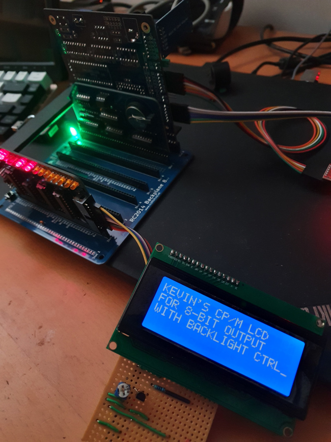
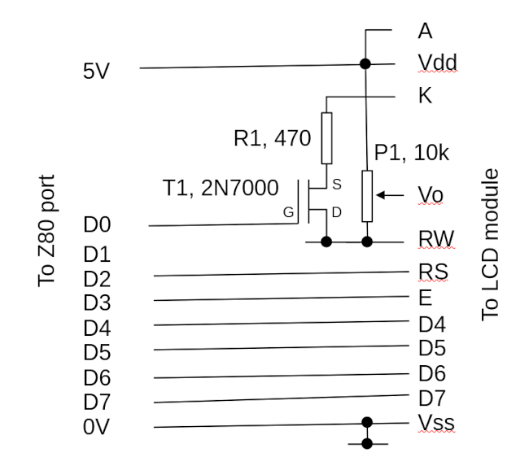
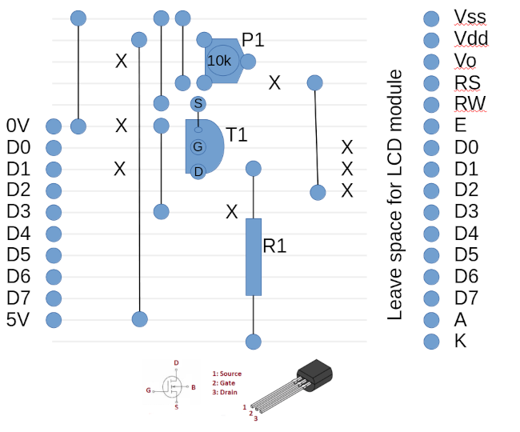

# cpmlcd 

Version 0.1a

## What is this?

`cpmlcd` is an assembly-language library for CP/M (Z80), for displaying
text on the popular HD44780 LCD module. It uses 4-bit data transfers, so 
only seven digital output lines are needed (the 4 data lines, enable (clock), 
register select, and backlight control). The backlight is expected
to be controlled by a circuit external to the LCD module (see below),
but this controller can be omitted, and the backlight just connected
to the 5V supply, leaving it permanently on. Leaving the backlight
permanently off isn't really an option other than in very bright
ambient light.

Here is the LCD module and control circuit in use with a RC2014-based
CP/M system.

The library should work with LCD modules of up to 4x64 characters, but
4x20 is the largest routinely available, and the largest I have
tested.

The utility `lcd.com` is a test driver for the library. It just
sends text specified on the CP/M command line to the LCD, starting in
the top-left corner. A number of escape characters can be
used to generate control characters, as the library supports
the handling of some of these. The text will wrap around lines when
it's too long to find on one line.

As is common when interfacing this LCD module, the driver only 
writes data, so it
cannot query the LCD to find when an operation is complete. This
means that we have to insert time delays between operations. Although
rather inelegant, this does mean that we can use a simple 8-bit 
output port for the control. I have been testing using the SC129
digital I/O module designed by Stephen Cousins, and documented here: 

https://smallcomputercentral.com/sc129-digital-i-o-rc2014/

A more sophisticated digital I/O module, such as one based on an
8255 chip, would also work; but custom initialization code would 
have to be added to set the I/O chip up. The SC129 has dedicated
inputs and outputs, so no particular set-up is required.

My wiring is loosely based on the example by
Stephen Cousins here:

https://smallcomputercentral.com/example-alphanumeric-lcd/

However, I've added backlight control, and the library has no
external dependencies. 

## Hardware and circuit

Using the HD44780 in four-bit mode requires as a minimum four data lines,
a register select line, a clock line, and (optionally) something
to switch the backlight. It makes the programming much easier if
we use the top four bits of the Z80 output port for the four
data lines, but the other line assignments are arbitrary (so long
as the code matches the configuration).

In my circuit I use a 10k potentiometer to control the display
brightness, as everybody does. I'm using a small MOSFET to switch
the backlight. The part I've chose (2N7000) will switch the full,
maximum backlight current, which might be as high as 160mA. However,
I have a current-limiting resistor because the full brightness is
just too bright for indoor use. The value of this resistor is not
critical, and a variable resistor could be used. However, be careful
with _small_ resistances, as the heat dissipation in the resistor could be
considerable. 

With the 470R resistor I'm using, the backlight current will be less
than 10mA, and might be low enough to be controlled directly by
a digital output port. However, there's no point risking this for the
sake of a transistor that costs fivepence.

I've built the control circuit on a scrap of stripboard -- it hardly
seems worth going to the trouble of designing a PCB. FWIW, my 
stripboard layout is shown below.

## Library usage

The library consists of two files: `lcd.asm`, the implementation, and
`lcd.inc`, a header file that contains function declarations and
documentation. It is designed to be assembled using the Microsoft
Macro80 assember and Link80 linker, although other tools might work. 

http://www.retroarchive.org/cpm/lang/m80.com
http://www.retroarchive.org/cpm/lang/l80.com

To use the library in another assembly-language program,
the code outline is:

    include lcd.inc

    CALL   lcd_init

    LD     b, 2      ; row
    LD     c, 3      ; column
    CALL   lcd_pos   ; set cursor position to 2,3

    LD HL, text
    CALL   lcd_str   ; display the text
    ...
    text: db 'Hello, world!', 0

The library is written to be able to accommodate different wiring 
arrangements;
the start of `lcd.asm` documents what might need to be changed. The 
default configuration matches the hardware shown in the circuit diagram
above. 

## Test driver usage

    lcd {/c} {/h} {/n} text...

CP/M being what it is, the text will always be rendered in upper case
letters -- that's a limitation of the CP/M command line, not the
library.

`/c` clears the display before writing. `/h` displays the help text.
`/n` just switches of the backlight -- it will be switched on when
displaying text.

The text can contain the following escape characters: `\b`, `\f`, 
`\n`, `\r` which mean respectively backspace, form feed, carriage
return, and line feed.

## Building

The library is designed to be integrated into another application, so
I can't give specific build instructions. For the test driver,
just assemble all the `.asm` files and link the resulting `.rel`
files. I usually build on Linux using a CP/M emulator, although it's
possible to build on CP/M. There is a `Makefile` for Linux, which 
requires a specific CP/M emulator (see the file itself for details).

## Control characters 

The `lcd_c_at` and `lcd_str` routines recognize four ASCII control
characters: 8 (non-destructive backspace), 10 (line feed), 12 (form feed),
and 13 (carriage return). Form feed means, essentially, clear the 
display. As is conventional on CP/M, both a line feed and carriage
return must be output to move the cursor to the start of the next
line.

## Limitations

### Time delays

The main problem with a simple implementation like this -- that uses
only digital outputs and no inputs -- is that we have to 
use arbitrary time delays
between operations. There's simply no way for the library to know when 
the LCD module is ready for more input, so it has to guess.
A better (but more complex) design would read
the module's ready status. Even then, it would still necessary to 
use time delays
for clocking each nibble of data in, and CP/M has no timing functions.
So there's always going to be a need to experiment with time delays.

I'm testing with an 18MHz Z180 and, so far, the time delays I've used
have been satisfactory. They will probably not be too short for
any mainstream Z80, but it's possible they will be too long. That won't
stop the driver working, but it will be slower than it should.

In `lcd.asm` I've marked where delays might need to be changed. Apart
from by being highly conservative, I don't really see any way to
get optimal values except by trial and error. The main symptom of
the delays being too short -- assuming that you see anything on the
display at all -- is garbled text.

### LCD module size

You can define the maximum rows and columns at the top of `lcd.asm`.
The driver won't stop the application trying to write text that simply
won't fit the display. On the to-do list is to implement a scroll buffer
so the text can automatically scroll in such circumstances. 

At present, what happens when you write too much text depends on the
specific module. It might just vanish, or it might wrap around to the
top. 

### Custom characters

The HD44780 module supports the uploading of a small number of custom
characters. This library does not implement that at present.

### Scrolling

There isn't any. It would be nice if the library could maintain a buffer
of text written, and use it to scroll up when output reaches the bottom
row. If I were to implement this, I would probably do it in C -- I'm
happy to use assembly-language for low-level bit-banging, but I'm not
sufficiently productive with it, to use it for complicated logic.

## Author and legal

`cpmlcd` is maintained by Kevin Boone, and is distributed under the terms of
the GNU Public Licence, v3.0, in the hope that, just maybe, somebody will
find it useful. All the code is original. There is no warranty of any kind.

## Revisions

v0.1a June 2023
First working version

